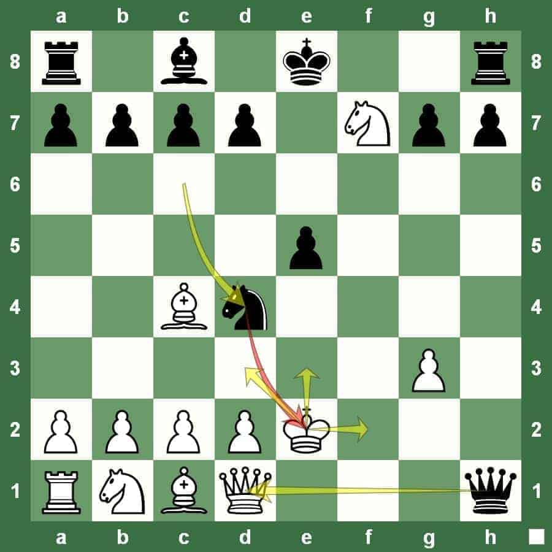
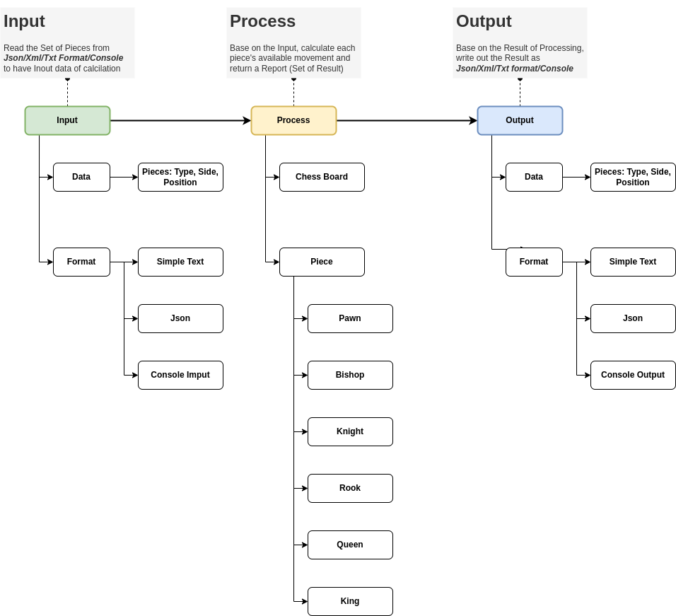

# kotlin-chessboard

## Chess Board Application

Place a set of chess pieces on the board and calculate each piece's available movements.



## Requirements

### Input 

Load Pieces information from file or console (command line) includes: 
- Type (PAWN, BISHOP, KNIGHT, ROOK, QUEEN, KING) 
- Side (BLACK, WHITE), 
- Postion of the piece on the Board

For Example: 

```
W: KE2, QD1, RA1, NB1, NF7, BC1, BC4, PA2, PB2, PC2, PD2, PG3
B: KE8, QH1, RA8, RH8, ND1, BC8, PA7, PB7, PC7, PD7, PE5, PG7, PH7
```

### Process

Base on Position of Pieces, calculate available movement of each one and collect the result to a Result Set

### Output

Generate the Result Set of movenent to the output, may be Console, Text, Json, XML...



## Code Quality Requirement

- Unit Test Coverage: Line Coverage >= 80%, Branch Coverage >= 70%
- SonarQube Static Analysis: No Critical and Major issues


